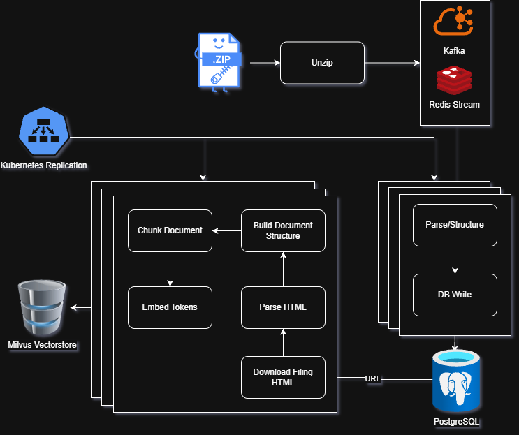

# Market Context Data Capture
This repo contains a data pipeline for the extraction, transform and load (ETL) of Corporate filings of publicly traded companies. The source of this data is the SEC EDGAR database `www.sec.gov/edgar/search`.

This pipeline relies on a number of dependencies including
- `PostgreSQL` data storage
- `Kafka/Redis` streaming for efficient memory usage
- `Milvus vector` datastore
- `Opentelemetry-LGTM` (Loki, Grafana, Tempo, Mimir, Prometheus) stack for observability 
- `Docker` containerization 
- `Kubernetes` container orchestration & replication

### How to run: 
This codebase leverages multiple services that run alongside it to support it's functioning. In order to run this codebase, you need to clone my [homeserver](https://github.com/SB325/homeserver) repo that spins up and runs all necessary services in docker containers. If you run those containers first, then running these containers should go smoothly.

**Option 1:**

It is easiest to run this project using the docker compose file (installing [docker](https://docs.docker.com/engine/install/) and [docker compose](https://docs.docker.com/compose/install/))

```sh
docker compose up -d
```

the compose files included in this file reference environment variables from a `.env` file. Use the `.env.template` file to fill in with your environment variables and rename the file to `.env`.

**Option 2:**

in Kubernetes via helm [charts](helm/Charts.yaml). These charts are not complete yet, but when they are, they will spin up an all includisve cluster, and running `homeserver` will not be necessary.


### What does this do?
The data extraction occurs in two separate ETL pipelines. 

**Pipeline #1** is to loads the filing metadata from .zip files to postgres. 

**Pipeline #2** downloads the actual filing html file from that metadata, then parses, embeds and indexes the filing data in a vectorstore. 

The first pipeline is operational and spins up from the docker-compose.yml. It streams metadata from the list of 8M+ filings (a small, rougly 1 year window of available filings data), and inserts them into a postgres database. This process takes approximately 90 minutes (without replication) on an Intel(R) Core(TM) i5-14500 with 128GB memory. With replication of data transform processes and postgres primaries, this latency should collapse substantially, even on a single server.

The second pipeline has been underway, but not yet completed. Attention has shifted to agentic workflow infrastructure that this project will eventually support. I anticipate this pipeline will be complete sometime this summer.

### System Diagram:


